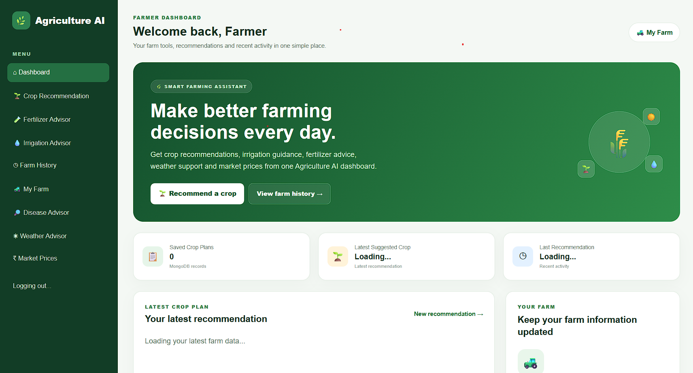
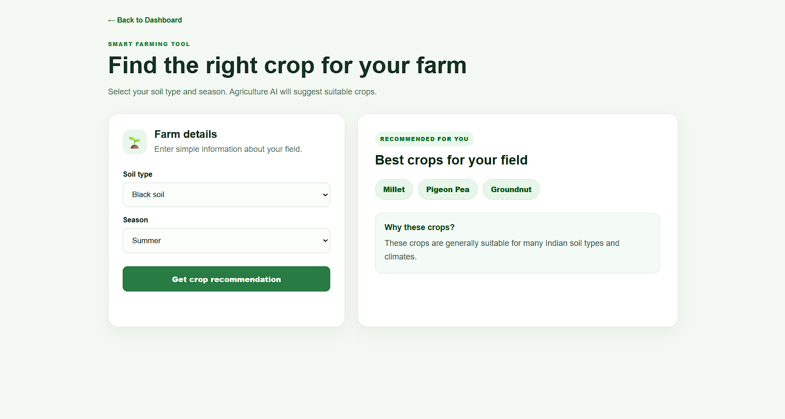
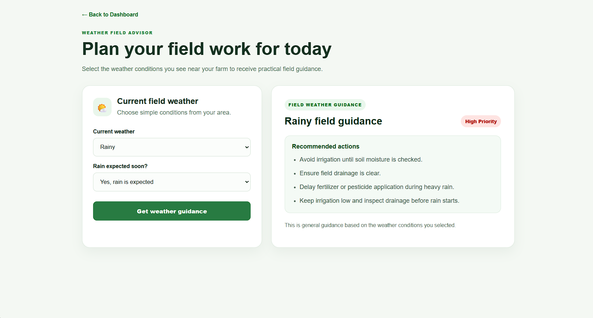
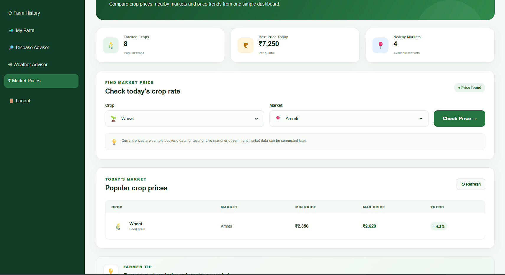
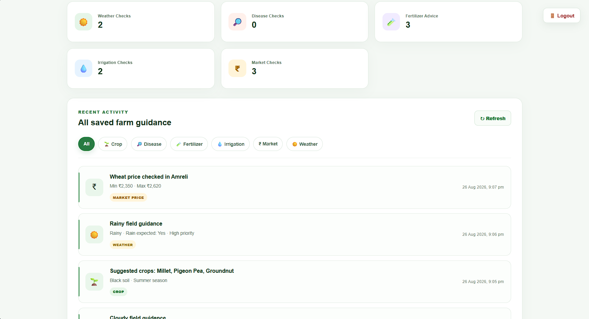
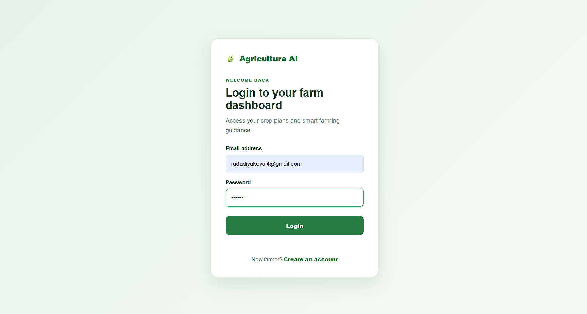
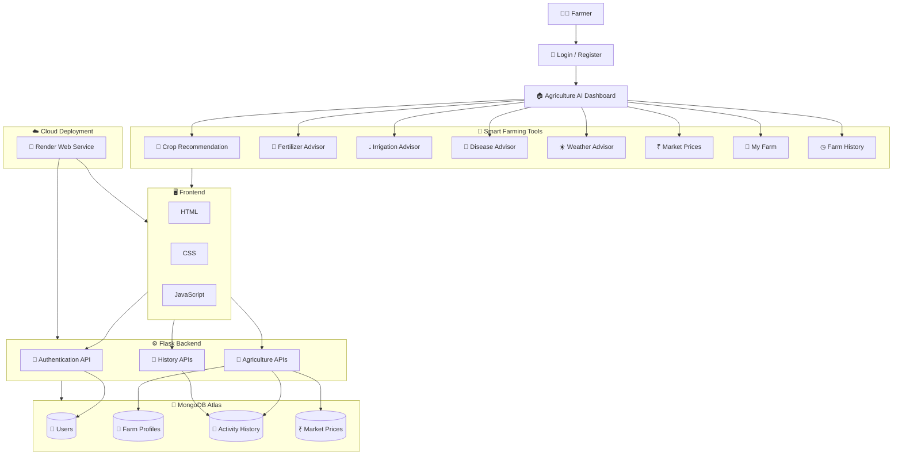
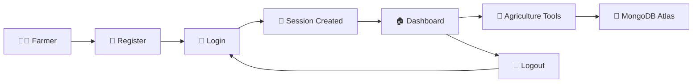
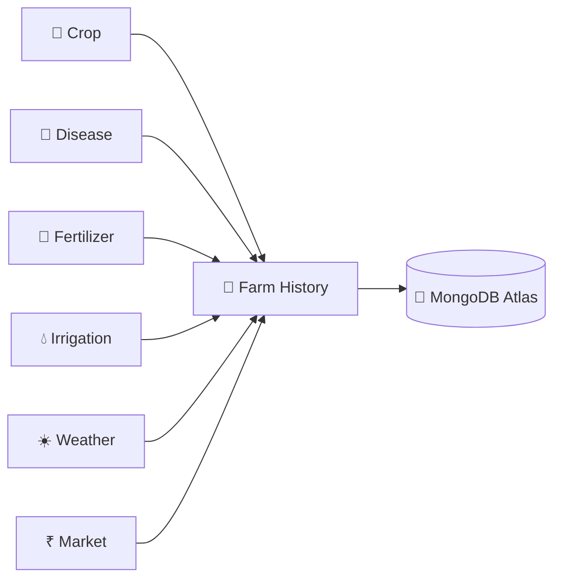

# 🌿 Agriculture AI

Agriculture AI is a farmer-friendly smart agriculture web application designed to help farmers make better farming decisions using simple digital tools.

The system provides crop recommendations, fertilizer guidance, irrigation advice, disease assistance, weather-based farming guidance, market prices, farm records, and activity history in one dashboard.

---

## 🌐 Live Project

🚀 **[Open Agriculture AI Live](https://agriculture-ai-nsel.onrender.com)**

> The project is deployed using Render and MongoDB Atlas.  
> Since it uses Render's free instance, the first load may take a few seconds after inactivity.

---

## 🌾 Project Overview

Agriculture AI focuses on providing a simple and easy-to-use farming assistant.

The interface is designed so that farmers can quickly access important farming tools without dealing with a complicated system.

The application stores farmer information and activity history in MongoDB and uses a Flask backend to process requests.

---

## ✨ Features

### 🌱 Crop Recommendation

- Select soil type
- Select farming season
- Get suitable crop recommendations
- View recommendation reasons
- Save recommendations in MongoDB

### 🧪 Fertilizer Advisor

- Select crop
- Select soil type
- Select crop growth stage
- Get fertilizer guidance
- Save advice history

### 💧 Irrigation Advisor

- Enter crop information
- Select soil type
- Provide moisture information
- Get irrigation recommendations
- Save irrigation history

### 🔎 Disease Advisor

- Enter crop name
- Enter crop symptoms
- Get possible disease guidance
- View risk information
- Save disease checks

### ☀️ Weather Advisor

- Select current weather condition
- Select whether rain is expected
- Get weather-based farming guidance
- View priority level
- Save weather advice in MongoDB

### ₹ Market Prices

- Select crop
- Select market
- Check minimum crop price
- Check maximum crop price
- View market price trends
- Store market searches in MongoDB

### 🚜 My Farm

- Save farmer farm information
- Store farm profile
- Update farm details
- Access farm information from the dashboard

### ◷ Farm History

View all saved activities in one place.

Available filters:

- 🌱 Crop
- 🔎 Disease
- 🧪 Fertilizer
- 💧 Irrigation
- ₹ Market
- ☀️ Weather

### 🔐 Authentication

- Farmer registration
- Farmer login
- Session-based authentication
- Protected pages
- Global logout
- Automatic redirect to login for unauthorized users

---

## 🖥️ Dashboard

The Agriculture AI dashboard provides quick access to all farming tools.

Dashboard includes:

- Latest crop recommendation
- Saved crop plans
- Latest suggested crop
- Last recommendation date
- Farm profile shortcut
- Crop Recommendation
- Fertilizer Advisor
- Irrigation Advisor
- Disease Advisor
- Weather Advisor
- Market Prices
- Farm History
- Logout

---

## 🛠️ Tech Stack

### Frontend


### Backend


### Database


### Deployment


### Development Tools


---

## 📸 Project Screenshots

### Dashboard



### Crop Recommendation



### Weather Advisor



### Market Prices



### Farm History



### Login



---

## 🔄 System Architecture



---

## 📂 Project Structure

```text
AgricultureAI/
│
├── client/
│   │
│   ├── index.html
│   ├── login.html
│   ├── register.html
│   │
│   ├── pages/
│   │   ├── crop-recommendation.html
│   │   ├── fertilizer-advisor.html
│   │   ├── irrigation-advisor.html
│   │   ├── disease-detection.html
│   │   ├── weather-advisor.html
│   │   ├── market-prices.html
│   │   ├── farm-history.html
│   │   └── my-farm.html
│   │
│   ├── css/
│   │   ├── dashboard.css
│   │   ├── crop-recommendation.css
│   │   ├── farm-history.css
│   │   └── market-prices.css
│   │
│   └── js/
│       ├── dashboard.js
│       ├── auth.js
│       ├── crop.js
│       ├── fertilizer.js
│       ├── irrigation.js
│       ├── disease.js
│       ├── weather.js
│       ├── market-prices.js
│       ├── farm-history.js
│       └── app-controls.js
│
├── server/
│   │
│   ├── app.py
│   ├── config.py
│   ├── seed_market_prices.py
│   │
│   ├── routes/
│   │   ├── auth_routes.py
│   │   ├── crop_routes.py
│   │   ├── disease_routes.py
│   │   ├── fertilizer_routes.py
│   │   ├── irrigation_routes.py
│   │   ├── weather_routes.py
│   │   ├── market_routes.py
│   │   └── farm_routes.py
│   │
│   ├── services/
│   │   └── crop_service.py
│   │
│   └── utils/
│       ├── auth_utils.py
│       └── localization.py
│
├── screenshots/
│   ├── dashboard.png
│   ├── crop-recommendation.png
│   ├── weather-advisor.png
│   ├── market-prices.png
│   ├── farm-history.png
│   └── login.png
│
├── .gitignore
└── README.md
```

---

## ⚙️ Installation

### 1. Clone the Repository

```bash
git clone https://github.com/Student-Keval2627/agriculture-ai.git
cd agriculture-ai
```

---

### 2. Create Python Virtual Environment

```bash
cd server
python -m venv venv
```

Activate it on Windows:

```bash
.\venv\Scripts\activate
```

---

### 3. Install Required Packages

```bash
pip install -r requirements.txt
```

---

## 🍃 MongoDB Setup

The project uses MongoDB for storing farmer information and application activity.

For local development:

```text
mongodb://127.0.0.1:27017/
```

For the live project, MongoDB Atlas is used as the cloud database.

The application uses MongoDB to store:

```text
Users
Crop History
Disease History
Fertilizer History
Irrigation History
Weather History
Market Prices
Market Search History
Farm Profiles
```

---

## 🔐 Environment Variables

Create a `.env` file inside the `server` folder.

```env
MONGO_URI=your_mongodb_connection_string
DATABASE_NAME=agriculture_ai
SECRET_KEY=your_secret_key
```

> Never upload your real `.env` file or database password to GitHub.

---

## ₹ Add Initial Market Price Data

Run the market price seed script once:

```bash
cd server
.\venv\Scripts\python.exe .\seed_market_prices.py
```

Expected output:

```text
Market prices added successfully.
Total records: 8
```

---

## ▶️ Run the Application Locally

Start the Flask backend:

```bash
cd server
.\venv\Scripts\python.exe .\app.py
```

The application will run at:

```text
http://127.0.0.1:5000
```

Open this URL in your browser.

---

## ☁️ Live Deployment

Agriculture AI is deployed online using:

```text
Frontend + Flask Backend → Render
Database                 → MongoDB Atlas
Repository               → GitHub
```

Live application:

**https://agriculture-ai-nsel.onrender.com**

The Render free instance may spin down after inactivity, so the first request may take a few seconds to start.

---

## 🔐 Authentication Flow



Protected pages automatically redirect unauthorized users to the login page.

---

## 🔌 Main API Routes

### Authentication

```text
POST /api/auth/register
POST /api/auth/login
GET  /api/auth/me
POST /api/auth/logout
```

### Crop Recommendation

```text
POST /api/crop/recommend
GET  /api/crop/history
```

### Disease Advisor

```text
POST /api/disease/check
GET  /api/disease/history
```

### Fertilizer Advisor

```text
POST /api/fertilizer/advice
GET  /api/fertilizer/history
```

### Irrigation Advisor

```text
POST /api/irrigation/advice
GET  /api/irrigation/history
```

### Weather Advisor

```text
POST /api/weather/advice
GET  /api/weather/history
```

### Market Prices

```text
GET  /api/market-prices
POST /api/market-prices
GET  /api/market-prices/history
```

### Farm Profile

```text
GET /api/farm/profile
PUT /api/farm/profile
```

### System

```text
GET /api/health
GET /api/database-status
```

---

## 🗃️ Farm History System

Farm History combines saved activity from the main Agriculture AI tools.



The records are filtered using the logged-in user's ID.

---

## 🎯 Project Goals

Agriculture AI aims to:

- Make digital farming tools easier to use
- Keep farming information in one place
- Help farmers make better crop decisions
- Provide simple farming recommendations
- Maintain farmer activity history
- Build a scalable foundation for future AI agriculture features

---

## 🚀 Future Improvements

Possible future features:

- 🌍 Real-time weather integration
- 📈 Live mandi market prices
- 📸 Image-based crop disease detection
- 🤖 Machine learning crop prediction
- 🌧️ Rainfall prediction
- 🌱 Soil nutrient analysis
- 📍 Location-based farming recommendations
- 📊 Farm analytics dashboard
- 🔔 Farmer alerts and notifications
- 🎤 Voice input for farmers
- 🌐 Gujarati and Hindi language support
- 📱 Mobile application

---

## 🔒 Security

The application includes:

- Session-based login
- Protected frontend pages
- User-specific MongoDB records
- Authentication-required API routes
- Logout session clearing
- Environment variable based configuration
- MongoDB Atlas IP access control

---

## 📌 Current Status

```text
✅ Authentication
✅ Dashboard
✅ Crop Recommendation
✅ Fertilizer Advisor
✅ Irrigation Advisor
✅ Disease Advisor
✅ Weather Advisor
✅ Market Prices
✅ My Farm
✅ Farm History
✅ MongoDB Atlas Integration
✅ User-specific History
✅ Global Logout
✅ Responsive UI
✅ Render Deployment
✅ Public Live URL
```

---

## 🔗 Important Links

🌐 **Live Project:**  
https://agriculture-ai-nsel.onrender.com

💻 **GitHub Repository:**  
https://github.com/Student-Keval2627/agriculture-ai

---

## 🤝 Contributing

Contributions, suggestions and improvements are welcome.

You can:

1. Fork the repository
2. Create a new branch
3. Make your changes
4. Commit your changes
5. Push the branch
6. Create a Pull Request

---

## 📄 License

This project is created for educational and learning purposes.

---

<div align="center">

### 🌿 Agriculture AI

**Smart Farming • Simple Decisions • Better Agriculture**

🚀 **[View Live Project](https://agriculture-ai-nsel.onrender.com)**

Made with ❤️ using Python, Flask, MongoDB Atlas, HTML, CSS and JavaScript.

</div>
